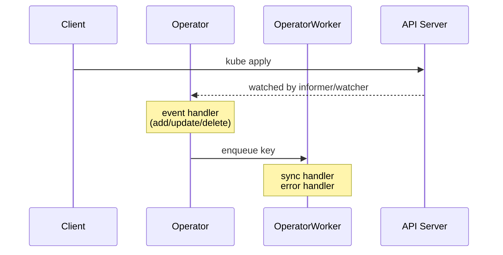

```mermaid
sequenceDiagram
participant Client
participant Operator
participant OperatorWorker
participant API Server

Client ->> API Server: kube apply
API Server -->> Operator: watched by informer/watcher

Note over Operator: event handler<br>(add/update/delete)

Operator ->> OperatorWorker: enqueue key

Note over OperatorWorker: sync handler<br>error handler

```

```bash
kool g -f example-config.yaml .
```